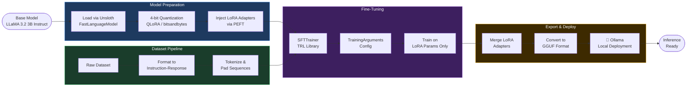
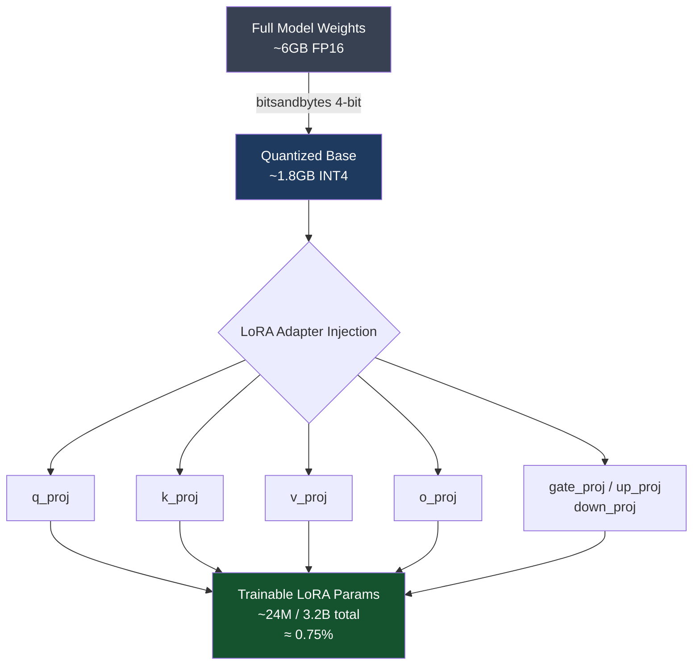
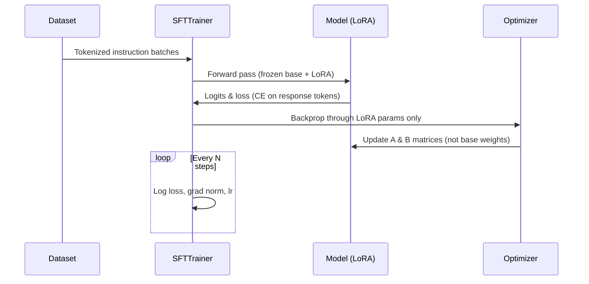
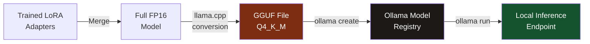

<div align="center">

#  LLaMA 3.2 Fine-Tuning with Unsloth & QLoRA

<p align="center">
  
  
  
  
  
</p>

<p align="center">
  
  
  
  
  
  
</p>

<br/>

> **End-to-end LLM fine-tuning pipeline** — from base model quantization to LoRA adapter training, GGUF conversion, and local deployment via Ollama. Built for efficiency on consumer hardware.

</div>

---

##  Table of Contents

- [Overview](#-overview)
- [Pipeline Architecture](#-pipeline-architecture)
- [How It Works](#-how-it-works)
- [Features](#-features)
- [Tech Stack](#-tech-stack)
- [Project Structure](#-project-structure)
- [Installation](#-installation)
- [Training Process](#-training-process)
- [Inference & Deployment](#-inference--deployment)
- [Results](#-results)
- [Future Improvements](#-future-improvements)
- [Acknowledgements](#-acknowledgements)

---

##  Overview

This project demonstrates a **complete, production-grade LLM fine-tuning pipeline** using **LLaMA 3.2 3B Instruct** as the base model. The pipeline leverages **QLoRA (4-bit quantization + LoRA)** for memory-efficient fine-tuning, making it feasible on consumer-grade GPUs with limited VRAM.

The fine-tuned model is exported to **GGUF format** for portability and deployed locally using **Ollama** — enabling fast, offline inference without cloud dependency.

###  Key Goals

| Goal | Approach |
|------|----------|
| Memory-efficient training | 4-bit quantization via `bitsandbytes` + `Unsloth` |
| Fast fine-tuning | LoRA adapters — only ~1–3% parameters trained |
| Instruction following | SFT on custom instruction-response dataset |
| Portable deployment | GGUF export + Ollama local inference |
| Reproducibility | Structured `TrainingArguments` + logged configs |

---

##  Pipeline Architecture



---

## 🔬 How It Works

### Step 1 — Base Model Loading with Unsloth

```python
from unsloth import FastLanguageModel

model, tokenizer = FastLanguageModel.from_pretrained(
    model_name="unsloth/Llama-3.2-3B-Instruct",
    max_seq_length=2048,
    dtype=None,           # Auto-detect: float16 / bfloat16
    load_in_4bit=True,    # QLoRA: 4-bit quantization
)
```

**Unsloth** provides highly optimized CUDA kernels that make LLaMA loading **2× faster** and **60% less VRAM** compared to vanilla HuggingFace loading.

---

### Step 2 — QLoRA: Quantization + LoRA Injection



**QLoRA** combines two techniques:
- **Quantization**: Compress weights to 4-bit integers (INT4), drastically reducing VRAM footprint.
- **LoRA (Low-Rank Adaptation)**: Inject small trainable rank-decomposition matrices (`A` and `B`) into target attention layers. Only these adapters are updated during training — the base model stays frozen.

```python
model = FastLanguageModel.get_peft_model(
    model,
    r=16,                          # LoRA rank
    target_modules=["q_proj", "k_proj", "v_proj", "o_proj",
                    "gate_proj", "up_proj", "down_proj"],
    lora_alpha=16,
    lora_dropout=0,
    bias="none",
    use_gradient_checkpointing="unsloth",
    random_state=42,
)
```

---

### Step 3 — Dataset Formatting

Conversations are structured in **ChatML / Alpaca-style instruction-response format** before tokenization:

```
<|begin_of_text|>
<|start_header_id|>system<|end_header_id|>
You are a helpful assistant.<|eot_id|>

<|start_header_id|>user<|end_header_id|>
{instruction}<|eot_id|>

<|start_header_id|>assistant<|end_header_id|>
{response}<|eot_id|>
```

---

### Step 4 — Fine-Tuning with SFTTrainer



```python
from trl import SFTTrainer
from transformers import TrainingArguments

trainer = SFTTrainer(
    model=model,
    tokenizer=tokenizer,
    train_dataset=dataset,
    dataset_text_field="text",
    max_seq_length=2048,
    args=TrainingArguments(
        per_device_train_batch_size=2,
        gradient_accumulation_steps=4,
        warmup_steps=5,
        num_train_epochs=3,
        learning_rate=2e-4,
        fp16=not is_bfloat16_supported(),
        bf16=is_bfloat16_supported(),
        logging_steps=10,
        optim="adamw_8bit",
        lr_scheduler_type="linear",
        output_dir="outputs",
    ),
)
trainer.train()
```

---

### Step 5 — GGUF Conversion & Ollama Deployment



```python
# Export to GGUF directly via Unsloth
model.save_pretrained_gguf("model_gguf", tokenizer, quantization_method="q4_k_m")
```

```bash
# Create and run with Ollama
ollama create my-llama -f Modelfile
ollama run my-llama "Explain quantum entanglement simply."
```

---

##  Features

-  **2× faster training** with Unsloth optimized kernels
-  **60% VRAM reduction** via 4-bit QLoRA quantization
-  **Parameter-efficient** — trains only ~0.75% of total parameters
-  **GGUF export** for universal compatibility (llama.cpp, Ollama, LM Studio)
-  **Ollama deployment** for zero-latency local inference
-  **Reproducible pipeline** with logged configs and checkpoints
-  **Consumer GPU friendly** — runs on 8GB+ VRAM

---

## 🛠 Tech Stack

| Category | Tool / Library | Purpose |
|----------|---------------|---------|
| **Base Model** | `meta-llama/Llama-3.2-3B-Instruct` | Foundation model |
| **Optimization** | `Unsloth` | Fast fine-tuning kernels |
| **Quantization** | `bitsandbytes` | 4-bit NF4 quantization |
| **Adapters** | `PEFT` | LoRA adapter injection |
| **Training** | `TRL (SFTTrainer)` | Supervised fine-tuning loop |
| **Config** | `transformers.TrainingArguments` | Hyperparameter management |
| **Export** | `llama.cpp` / Unsloth GGUF | Model format conversion |
| **Inference** | `Ollama` | Local model serving |
| **Dataset** | `datasets (HuggingFace)` | Data loading & formatting |

---

##  Project Structure

```
llama-finetune/
│
├── 📓 notebooks/
│   ├── 01_data_preparation.ipynb      # Dataset formatting & EDA
│   ├── 02_finetune_unsloth.ipynb      # Main fine-tuning notebook
│   └── 03_inference_test.ipynb        # Post-training inference tests
│
├── 📂 data/
│   ├── raw/                           # Original dataset files
│   └── processed/                     # Formatted instruction-response JSONs
│
├── 📂 configs/
│   └── training_config.yaml           # All hyperparameters in one place
│
├── 📂 src/
│   ├── data_utils.py                  # Dataset formatting helpers
│   ├── train.py                       # Training entry point
│   └── inference.py                   # Local inference script
│
├── 📂 outputs/
│   ├── checkpoints/                   # Saved model checkpoints
│   ├── lora_adapters/                 # Trained LoRA weights
│   └── gguf/                          # Exported GGUF model files
│
├── 📄 Modelfile                       # Ollama Modelfile for deployment
├── 📄 requirements.txt
└── 📄 README.md
```

---

##  Installation

### Prerequisites

- Python 3.10+
- CUDA-compatible GPU (8GB+ VRAM recommended)
- [Ollama](https://ollama.ai) installed for inference

### 1. Clone the Repository

```bash
git clone https://github.com/shreejoshi/llama-finetune-unsloth.git
cd llama-finetune-unsloth
```

### 2. Install Dependencies

```bash
pip install "unsloth[colab-new] @ git+https://github.com/unslothai/unsloth.git"
pip install --no-deps trl peft accelerate bitsandbytes
pip install transformers datasets
```

Or use the requirements file:

```bash
pip install -r requirements.txt
```

### 3. HuggingFace Authentication (for gated models)

```bash
huggingface-cli login
# Enter your HF token with read access to meta-llama models
```

---

##  Training Process

### Prepare Your Dataset

Format your data as instruction-response pairs in JSONL:

```json
{"instruction": "What is gradient descent?", "response": "Gradient descent is an optimization algorithm..."}
{"instruction": "Explain backpropagation.", "response": "Backpropagation is the algorithm used to..."}
```

Then run the formatting script:

```bash
python src/data_utils.py --input data/raw/dataset.jsonl --output data/processed/
```

### Start Fine-Tuning

```bash
python src/train.py --config configs/training_config.yaml
```

### Key Hyperparameters

```yaml
# configs/training_config.yaml
model_name: "unsloth/Llama-3.2-3B-Instruct"
max_seq_length: 2048
load_in_4bit: true

lora:
  r: 16
  alpha: 16
  dropout: 0.0
  target_modules: [q_proj, k_proj, v_proj, o_proj, gate_proj, up_proj, down_proj]

training:
  batch_size: 2
  gradient_accumulation_steps: 4
  epochs: 3
  learning_rate: 2e-4
  optimizer: "adamw_8bit"
  scheduler: "linear"
  warmup_steps: 5
```

### Export to GGUF

```python
# After training
model.save_pretrained_gguf("outputs/gguf", tokenizer, quantization_method="q4_k_m")
```

---

##  Inference & Deployment

### Option A: Direct Python Inference

```python
from unsloth import FastLanguageModel

model, tokenizer = FastLanguageModel.from_pretrained(
    model_name="outputs/lora_adapters",
    max_seq_length=2048,
    load_in_4bit=True,
)
FastLanguageModel.for_inference(model)  # Enable 2x faster inference

messages = [{"role": "user", "content": "Explain transformers in simple terms."}]
inputs = tokenizer.apply_chat_template(messages, return_tensors="pt").to("cuda")

outputs = model.generate(input_ids=inputs, max_new_tokens=256, temperature=0.7)
print(tokenizer.decode(outputs[0], skip_special_tokens=True))
```

### Option B: Ollama Deployment

**Create a Modelfile:**

```dockerfile
# Modelfile
FROM ./outputs/gguf/model-q4_k_m.gguf

SYSTEM "You are a helpful AI assistant fine-tuned for specific tasks."

PARAMETER temperature 0.7
PARAMETER top_p 0.9
PARAMETER num_ctx 2048
```

**Deploy and Run:**

```bash
# Register the model with Ollama
ollama create my-llama -f Modelfile

# Run inference
ollama run my-llama "What is the capital of France?"

# Or via REST API
curl http://localhost:11434/api/generate -d '{
  "model": "my-llama",
  "prompt": "Explain attention mechanisms.",
  "stream": false
}'
```

---

##  Results

### Training Metrics

| Metric | Value |
|--------|-------|
| Base Model Parameters | ~3.2B |
| Trainable Parameters (LoRA) | ~24M (≈0.75%) |
| Training VRAM Usage | ~6–7 GB |
| Training Speed (vs vanilla) | ~2× faster |
| Final Training Loss | *logged per run* |
| GGUF Model Size (Q4_K_M) | ~2.0 GB |

### Inference Comparison

| Mode | Latency (first token) | Memory |
|------|-----------------------|--------|
| FP16 HuggingFace | ~800ms | ~6.5 GB |
| 4-bit Unsloth | ~420ms | ~2.8 GB |
| GGUF Q4_K_M (Ollama) | ~180ms | ~2.0 GB |

---

##  Future Improvements

- [ ] **DPO / RLHF** — Add preference alignment post-SFT for better instruction following
- [ ] **Larger Datasets** — Scale training data with domain-specific corpora
- [ ] **LLaMA 3.2 11B** — Experiment with larger model variant
- [ ] **Evaluation Framework** — Integrate `lm-evaluation-harness` for benchmark scoring
- [ ] **Quantization Comparison** — Benchmark Q4_K_M vs Q5_K_M vs Q8_0 GGUF variants
- [ ] **vLLM Deployment** — Serve fine-tuned model with OpenAI-compatible API via vLLM
- [ ] **Multi-GPU Training** — Add FSDP / DeepSpeed config for multi-GPU setups
- [ ] **Weights & Biases Integration** — Full experiment tracking with W&B dashboard

---

